# GitHub Statistics

<picture>
  <source media="(prefers-color-scheme: dark)" srcset="./profile/stats_dark.svg">
  
</picture>
<picture>
  <source media="(prefers-color-scheme: dark)" srcset="./profile/languages_dark.svg">
  
</picture>

